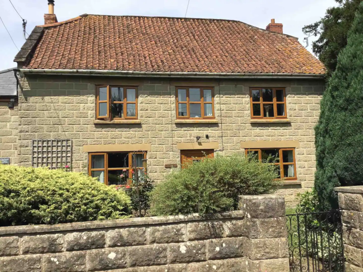

```{r setup, include=FALSE}
knitr::opts_chunk$set(echo = TRUE)
```



# Accommodation

Here is where we'll be staying: <https://www.airbnb.co.uk/rooms/32802521>

## Location

The address is Henley Road, Henley, TA10 9BG.

## Weather

Link to weather forecast for this postcode: <https://www.bbc.co.uk/weather/ta10>.

## Miscellaneous house information

 - There is a table tennis *net* on a regular table.

 - There is a shuffleboard.
 
 - There are 2 bathrooms; one with a bath and one with a shower.
 
 - There is outdoor seating.
 
 - There is a barbeque.
 
 - There is a wood burner. "We will supply enough logs and kindling for a welcome fire and can provide more at cost price if needed."
 
 - The AGA isn't working.
 
 - They will provide a hair dryer, soap and towels but _not_ shampoo.
 
 - There will be books and toys for children aged 0-10.
 
 - There is a cafetiere.
 
 - There is a DVD player.

# Food

We can bring our own food for breakfast and lunch, though they will provide "bread, butter, jam, marmalade, milk, tea, coffee, fruit juices & eggs". For dinner, we can bring ingredients for a couple of nights of dinners each. If you don't want to make vegan dinners, _that's fine_, just let me know in advance and I can plan what to make for me and Lisa!

In case it helps you plan meals, I am taking my blender. No regrets.

**Dinners I will make**: Tomato and sausage casserole with rice. Baked tofu with veg. 

## Supermarkets

There is a Tesco Superstore 10 minutes south.

In Glastonbury, about 15-20 minutes north-east (near the outlet shopping centre), there is an ALDI (yes!), a Sainsbury's and another Tesco Superstore all right next to one another


# Outside the accommodation

## The host

The host suggests the following things to do:

 - The Shapwick nature reserve is only 10 minutes drive across the moors.

 - Clark's village is 15 minutes drive away and Glastonbury 20 minutes.

 - We are also within a reasonable distance of Wells with its lovely cathedral.

 - Central Somerset has lots of excellent, independent cafe's and restaurants, many of whom are committed to using locally sourced produce.

 - There are many places suitable for a family day out within a reasonable distance and we have some excellent national trust properties nearby as well.
 
 - For a list of things, including **Safari Tots** (15 minutes away), see her "guidebook" here: <https://www.airbnb.co.uk/s/guidebooks?refinement_paths[]=/guidebooks/2383123>

Lisa is particularly interested in Clark's Village, which is a big outlet place: <https://clarksvillage.co.uk/>

## ChatGPT

I used AI(ChatGPT) for some suggestions on where to go and here is what it suggested:

 - Glastonbury Tor: Climb to the top of Glastonbury Tor for panoramic views of the surrounding countryside. It's a historic and spiritual site with a fascinating history.

 - Cheddar Gorge: Explore the stunning Cheddar Gorge, known for its dramatic limestone cliffs and cave systems. You can go hiking, caving, or simply enjoy the breathtaking scenery.

 - Wookey Hole Caves: Visit the famous Wookey Hole Caves, where you can take guided tours through underground chambers, learn about the cave's history, and even see the resident witch!

 - Wells Cathedral: Explore the picturesque city of Wells and visit Wells Cathedral. The cathedral's stunning architecture and serene surroundings make it a must-see attraction.

 - Bath: While not in Central Somerset, Bath is relatively close and worth a visit. Explore the Roman Baths, Bath Abbey, and the beautiful Georgian architecture. The Thermae Bath Spa offers a modern twist with its rooftop thermal pool.

 - Countryside Walks: Central Somerset offers numerous walking trails through picturesque countryside, charming villages, and rolling hills. Check out local maps or websites for recommended routes.

## My suggestions

I've found the following:

 - RSPB Greylake: 10 min drive, small nature reserve.
 
 - RSPB Ham Wall, RSPB Swell Wood: further out nature reserves.
 
 - Millenium Wood: 4 min drive, 20 min walk. Small park/walk, including den building and other kids' activities.
 
 - Pitney Farm Shop. 10 min drive. Small organic farm with small shop and small cafe.
 
 - The Pyramid Vegan Cafe and Bakery. Obviously. 19 min drive, Glastonbury. Rated 4.9/5 from 70 reviews.
 
 - I've received a request for swimming pools! There is an outdoor swimming pool right next to the outlet shopping centre 20 minutes away: <https://www.greenbankpool.co.uk/>
 
 - Glastonbusy Reclamation (<www.glastonburyreclamation.co.uk>) has old and interesting things for sale for home and garden.

# Ideas for in/around the house

 - Invite JP to visit -- I've texted him already.
 
 - Board games (woo!)
 
 - On saturday night, a storyteller from Cambridge will be doing a live reading of a ghost story. It's at 8pm but will be available to view afterwards. The story is The Signalman, by Charles Dickens.
 
 - Football (big garden)